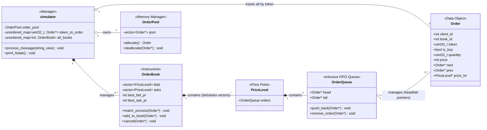

[some slides I made to detail things](https://docs.google.com/presentation/d/1cTItXUDj4uLFCZI2_ZeLM9N24XDMve74x1uy0T8qtGk/edit?usp=sharing)

simulator's core is OrderBook , the orderbook contains the two sides of bids and asks

Each side is a doubly linked list (pricelevel) objects, sorted by price priority (bids=high-to-low, asks= low-to-high)

at each pricelevel there is a queue (custom `OrderQueue` for pointer reallocation) of orders listed at that price ;  this queue ensures time priority  i.e first-in, first-out

#### Matching / processing:

Upon every order entered from input:

- parser splits line into string_view tokens (no copies)

- route to either create or cancel order on first token

- on new order: we collect next available object from the pool (`allocate()`) - populate it with our fields, and pass to create_order

- we check order within price bounds, then we find existing or create its associated book, then we proceed to matching

- get opposite pricelevl, and compare the head of the queues for cross match; if true we go through the level trading resting order quantities until either the level is exhausted or incoming order is fulfilled. If new level then we have to **re-search** for the next non-empty price level (this is one fault point of flat vector approach)

- if order fulfilled we return memory to pool, else we add it to book 

Any cancellations are handled by removing order from price level, then returning memory to pool by deallocating 

