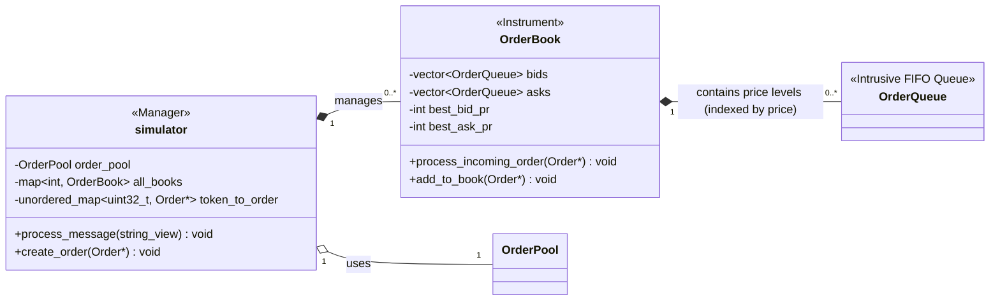
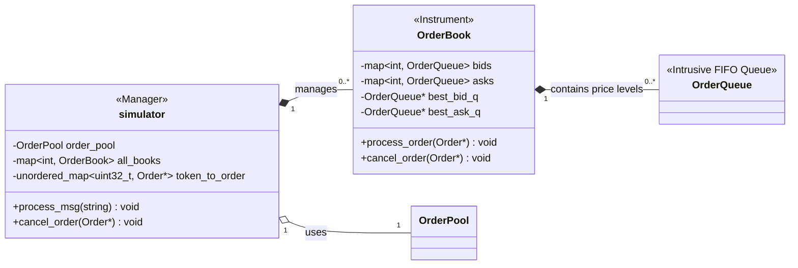
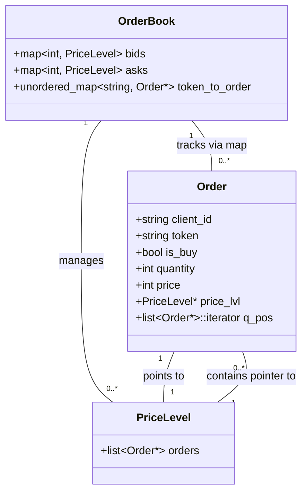
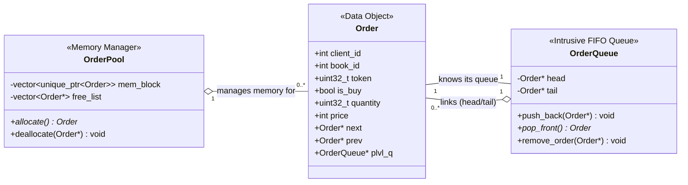

# limit_orderbook

Three C++ implementations of a limit order book matching engine, plus a benchmark
suite that runs all of them over the same workloads and compares throughput and memory.

[some slides I made to detail things](https://docs.google.com/presentation/d/1cTItXUDj4uLFCZI2_ZeLM9N24XDMve74x1uy0T8qtGk/edit?usp=sharing)

## Build and run

```sh
g++ -O2 -std=c++20 flatvec_intrusive.cpp -o flatvec
./flatvec data/input_orders.txt
```

The large workloads the suite expects are generated,
since messages make up a few hundred MB. recreate them via:

```sh
python tools/gen_workload.py -n 10000  -o data/work_10k.txt
python tools/gen_workload.py -n 1000000 -o data/work_1m.txt
python tools/gen_workload.py -n 1000000 -x 0.5 -o data/work_high-churn.txt
```

Then:

```sh
g++ -O2 -std=c++20 benchmark_suite.cpp -o bench && ./bench
```

## Design

simulator's core is OrderBook , the orderbook contains the two sides of bids and asks

Each side (bid/ask) there is a storage of Orders, sorted by price priority (bids=high-to-low, asks= low-to-high) either via map or linked list.

at each pricelevel there is a queue/list (non LL version) of orders listed for that price ;  this queue is time prioritised  i.e first-in, first-out


#### Matching / processing:

Upon every order entered from input:

- this incoming order is checked against the opposite side of its designated book for a price match, if no match then we create a new level and place this new order in it 

- a match will then accumulate a quantity off of trades from that matched price level's queue until either incoming is fulfilled or level is empty. Each trade occurs at the resting order's price


- If order is fully filled; it's removed from the book. the pricel level is *also* removed (except for direct-index ver) if either: 
    1. Its order queue is genuinely empty (all orders consumed/cancelled) 

    2. The incoming order still has quantity to match, AND we have processed all orders at this `trade_price` level (resting_ord is nullptr, thus the inner loop exhausted the level)          

- if this incoming order is still only partially filled after going through all matching resting orders ;  its remaining quantity is added to the book as a new resting order at its specified price level


Any cancellations are handled by looking up the order's unique token in the token->Order ptr hashmap and removing it from its price queue

also,  for simplicity and since its very small project ; manually managing the memory is easier + more suitable over smart pointers overhead (even though completely negligible for this)


#### multiple books:

simulator Class:
- top-manager that contains a map i.e std::map<int, OrderBook> all_books, its the main router

When an order arrives for a new orderbook ID;  an `OrderBook` is dynamically created and inserted into that map,  all messages with that book id are routed to it

Orderbook struct:
- Each instance represents a single instrument
- has its own bid and ask sides and is completely independent of other book instances

Our pooling covers all books though, so one large allocation to handle all books simulatenously


#### flatvec_intrusive:


#### map_LL_intrusive:



#### map_stdlist:


#### Order struct helpers:

