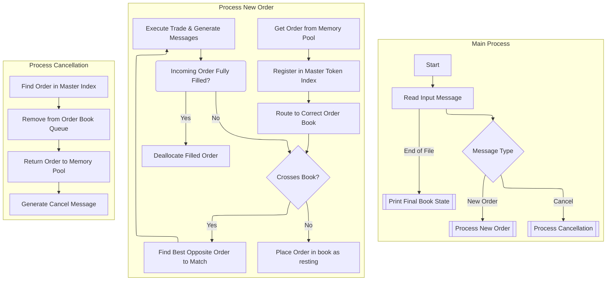

[some slides I made to detail things](https://docs.google.com/presentation/d/1cTItXUDj4uLFCZI2_ZeLM9N24XDMve74x1uy0T8qtGk/edit?usp=sharing)

simulator's core is OrderBook , the orderbook contains the two sides of bids and asks

Each side is a doubly linked list (pricelevel) objects, sorted by price priority (bids=high-to-low, asks= low-to-high)

at each pricelevel there is a queue (custom `OrderQueue` for pointer reallocation) of orders listed at that price ;  this queue ensures time priority  i.e first-in, first-out

#### Matching / processing:

Upon every order entered from input:

- this incoming order is checked against the opposite side of its designated book for a price match, if not then we create a new level and place this new order in it 

- a match will then accumulate a quantity off of order trades in that matched price level's queue until either incoming is fulfilled or level is empty. Each trade occurs at the resting order's price

- If order is fully filled; it's removed from the book and separately if the price level becomes empty, it's also removed to keep book clean

- if this incoming order is still only partially filled after all possible matches ;  its remaining quantity is added to the book as a new resting order at its specified price level

Any cancellations are handled by looking up the order's unique token in the token->Order ptr hashmap and removing it from its price queue

also,  for simplicity and since its very small project ; manually memory is easier + more suitable over smart pointers overhead (even though completely negligible for this)

